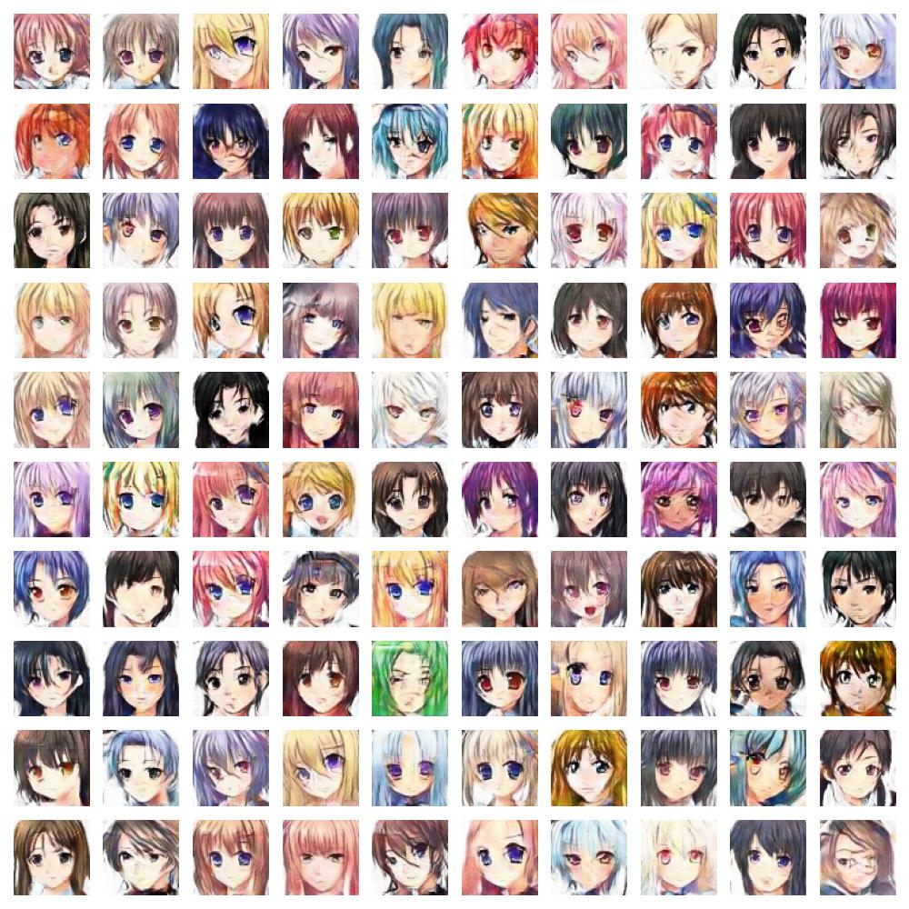
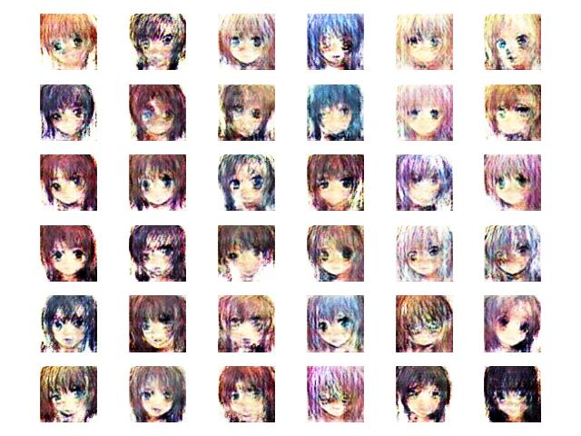
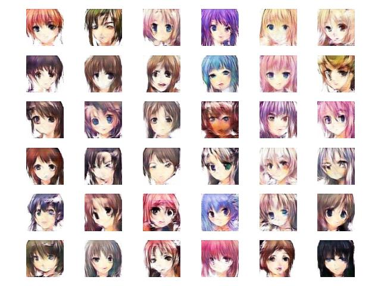

# Generate Anime Face with DCGAN

Implement DCGAN to generate 64x64 Anime Face Images



## Environments

- Python 3.10.6

> Also work with 
> - Python 3.8.0

Install environments with

``` bash
bash scripts/setup_environments
```

## Data

You can get dataset from [here](https://www.kaggle.com/datasets/splcher/animefacedataset) or download from [here](https://drive.google.com/file/d/1fYE2BMtw4em23u6Pv1gUkzRQ0TTCfoh6/view?usp=share_link) (Private)

## Checkpoint

You can download pretrained weight for [Net_G](https://drive.google.com/file/d/1ojU_LhRBVBkLS3Zuk1hNyTtaTies4jwm/view?usp=share_link), train with default config. But I recommend you to retrain from scratch with your own experiments

Here is pretrained for [Net_D](https://drive.google.com/file/d/1942sPF5QFrCrhAHpc59vHqCzlt7YVPEr/view?usp=share_link)

## Train

You can modify config in `cfg/cfg.py` and run

``` bash
python tools/train.py
```

## Infer

After training, you get weight for model in `training_runs/exp...`, set weight in `best_checkpoint` of config and run

``` bash
python tools/infer.py
```

## Result

- Epoch 1


- Epoch 10



- Epoch 50



## Reference

- [Anime Face Dataset](https://www.kaggle.com/datasets/splcher/animefacedataset)
- [Ksuryateja/DCGAN-CIFAR10-pytorch](https://github.com/Ksuryateja/DCGAN-CIFAR10-pytorch)
- [How to Train a GAN? Tips and tricks to make GANs work](https://github.com/soumith/ganhacks)