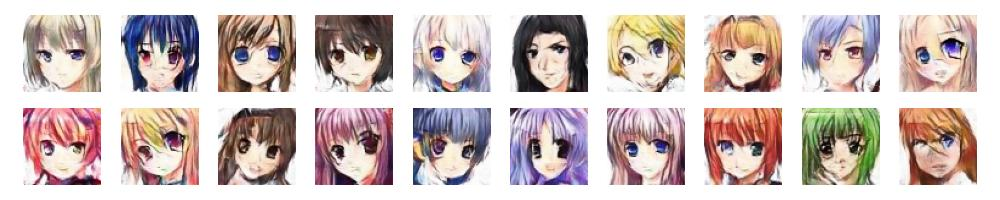
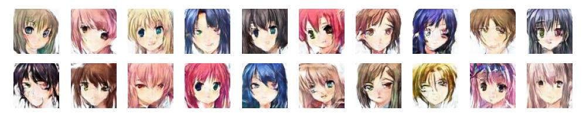

# Generate Anime Face with DCGAN

Implement DCGAN and LSGAN to generate 64x64 Anime Face Images


## Environments

- Python 3.10.6

> Also work with 
> - Python 3.8.0

Install environments with

``` bash
bash scripts/setup_environments
```

## Data

You can get dataset from [Kaggle](https://www.kaggle.com/datasets/splcher/animefacedataset) or download from [Google Drive](https://drive.google.com/file/d/1fYE2BMtw4em23u6Pv1gUkzRQ0TTCfoh6/view?usp=share_link) (Private)

## Checkpoint

You can download pretrained weight for Net_G and Net_D below. But I recommend you to retrain from scratch with your own experiments

| Model | Checkpoint | FID |
| --- | --- | --- |
| DCGAN | [Net_G](http://bit.ly/3ZXCqG5), [Net_D](http://bit.ly/412iDXh) | 88.75 |
| DCGAN + LSGAN | [Net_G](http://bit.ly/3ZZyCUP), [Net_D](http://bit.ly/405ZUsG) | 89.69 |

## Train

Firstly, compute statistics for train dataset (mean and variance) with 

```bash 
python tools/calculate_statistics.py
```

You can modify config in `cfg/cfg.py` and run

``` bash
python tools/train.py
```

## Infer

After training, you get weight for model in `training_runs/exp...`, set weight in `best_checkpoint` of config and run

``` bash
python tools/infer.py
```

## Result

With DCGAN base, FID minimum score is **88.75** at epoch 355 



With DCGAN + LSGAN, FID minimum score is **89.69** at epoch 128



## Citation

<details>
  <summary>Click here to expand</summary>
  
``` bibtex
@misc{spencer churchill_brian chao_2019,
	title={Anime Face Dataset},
	url={https://www.kaggle.com/ds/379764},
	DOI={10.34740/KAGGLE/DS/379764},
	publisher={Kaggle},
	author={Spencer Churchill and Brian Chao},
	year={2019}
}

@misc{radford2015unsupervised,
  abstract = {In recent years, supervised learning with convolutional networks (CNNs) has
seen huge adoption in computer vision applications. Comparatively, unsupervised
learning with CNNs has received less attention. In this work we hope to help
bridge the gap between the success of CNNs for supervised learning and
unsupervised learning. We introduce a class of CNNs called deep convolutional
generative adversarial networks (DCGANs), that have certain architectural
constraints, and demonstrate that they are a strong candidate for unsupervised
learning. Training on various image datasets, we show convincing evidence that
our deep convolutional adversarial pair learns a hierarchy of representations
from object parts to scenes in both the generator and discriminator.
Additionally, we use the learned features for novel tasks - demonstrating their
applicability as general image representations.},
  added-at = {2019-11-01T17:00:38.000+0100},
  author = {Radford, Alec and Metz, Luke and Chintala, Soumith},
  biburl = {https://www.bibsonomy.org/bibtex/2a114a1bd36bb9b5542f620b0c1d1c050/jil},
  description = {Unsupervised Representation Learning with Deep Convolutional Generative Adversarial Networks},
  interhash = {ae6fc4b7593a1d0e31aeeff9fef81a36},
  intrahash = {a114a1bd36bb9b5542f620b0c1d1c050},
  keywords = {cnn convolution deep generative learning nn},
  note = {cite arxiv:1511.06434Comment: Under review as a conference paper at ICLR 2016},
  timestamp = {2019-11-01T17:00:38.000+0100},
  title = {Unsupervised Representation Learning with Deep Convolutional Generative
  Adversarial Networks},
  url = {http://arxiv.org/abs/1511.06434},
  year = 2015
}

@article{arxiv1611.04076,
  author = {Xudong Mao and Qing Li and Haoran Xie and Raymond Y.K. Lau and Zhen Wang and Stephen Paul Smolley},
  title = {Least Squares Generative Adversarial Networks},
  journal = {arXiv preprint arXiv:1611.04076},
  year = {2016}
}

@misc{Seitzer2020FID,
  author={Maximilian Seitzer},
  title={{pytorch-fid: FID Score for PyTorch}},
  month={August},
  year={2020},
  note={Version 0.3.0},
  howpublished={\url{https://github.com/mseitzer/pytorch-fid}},
}
```

 
</details>

## Reference

- [Anime Face Dataset](https://www.kaggle.com/datasets/splcher/animefacedataset)
- [Ksuryateja/DCGAN-CIFAR10-pytorch](https://github.com/Ksuryateja/DCGAN-CIFAR10-pytorch)
- [How to Train a GAN? Tips and tricks to make GANs work](https://github.com/soumith/ganhacks)